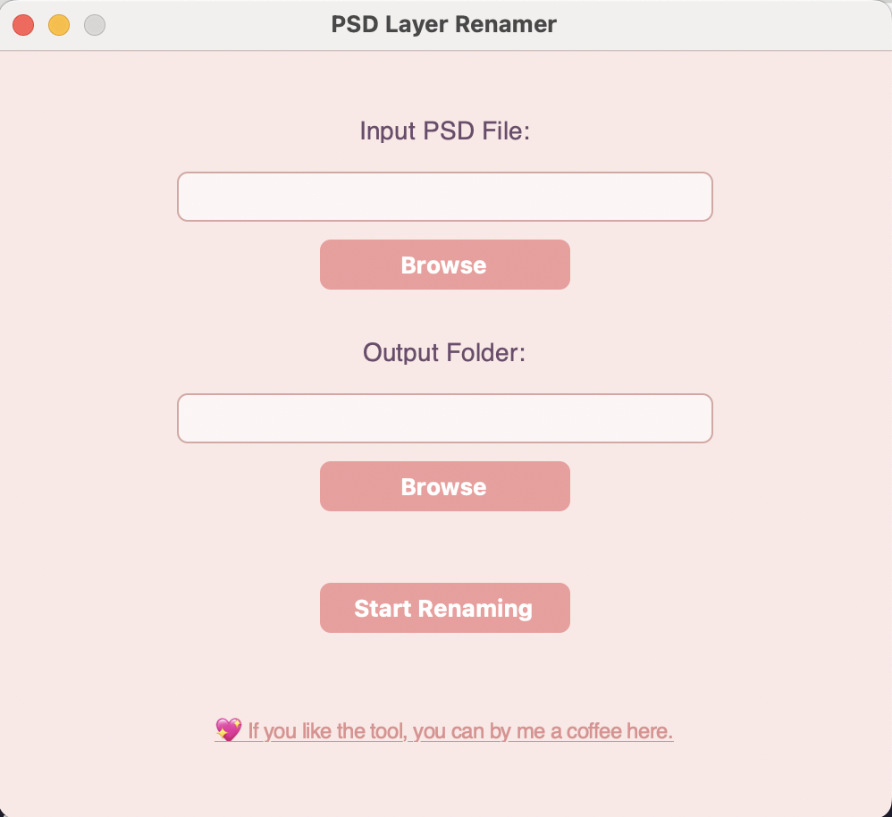

# PSD Layer Renamer/Suffixer

Ein Programm zum automatischen suffixen von doppelten Ebenen in einer PSD-Datei.

### Kompatibel mit:

## Beschreibung

Dieses Skript durchsucht eine Photoshop PSD-Datei (.psd) und identifiziert Ebenen mit doppelten Namen. Es benennt diese Ebenen automatisch um, indem es ein Suffix hinzufügt, um sicherzustellen, dass jeder Ebenenname eindeutig ist. Das Skript kann nützlich sein, um Probleme bei der Verarbeitung oder Konvertierung von PSD-Dateien zu vermeiden, die durch doppelte Ebenennamen verursacht werden.

Supportet wird bisher Windows und Mac.

## Funktionen

	•	Öffnet und liest PSD-Dateien.
	•	Identifiziert doppelte Ebenennamen.
	•	Bennent doppelte Ebenen automatisch um, indem ein Suffix hinzugefügt wird.
	•	Speichert die modifizierte PSD-Datei.

## Benutzen
- Downloade die Datei aus dem Windows oder Mac Ordner
- Führe sie aus
- Pfad deiner PSD Datei kopeier
- In die Konsole pasten
- Enter drücken
- Dann für den Ausgabe Pfad einfach den Pfad nochmal pasten und den namen der Datei anpassen.
- Enter drücken
- Dann wird die Datei direkt da gesaved wo die andere liegt nur mit anderem Namen

Hier ein Demo Video:

 